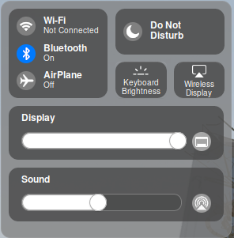

# macOS 11.0 Control Center for linux enviroment

## ⚠ Only support XFCE distro



* This is a version based from <a href="https://github.com/libredeb/comice-control-center">comice control center</a> but added more feature

## 💾 Installation

* Download the release or 
```bash
git clone https://github.com/kleqing/macOS-control-center-for-linux
```
* Extract file (for download the release)
* Open terminal at directory and type (for git clone)
```bash
cd macOS-control-center-for-linux
```
* Arch Linux
```bash
sudo pacman -S util-linux gsettings-desktop-schemas wireless_tools iproute alsa-utils dbus-python python-pip
```
* Other distro (Not test yet)
```bash
sudo apt-get install python3 python3-dbus util-linux gsettings-desktop-schemas wireless-tools iproute alsa-utils
```
* Then:
```bash
sudo pip3 install -r requirements.txt
```
```bash
./comice-control-center
```

## ⚠ Attention

This is a fake control center and it build from python so it cann't control the hardware like: Change brightness, sound, turn on/off wifi,....


## ❓Issues
* Basically, i make a dark mode version but the problem is if you want to change themes from Light to Dark mode, you have to do this:
	* Open 'macOS-control-center-for-linux' and go to themes folder, you will see a folder named Light and Dark (Default is dark mode)
	* Open the Light/Dark folder, you will see 2 files
	* Copy all the file in that, then go to folder named 'comicecontrolcenter'
	* Paste the files and replace them
* A bluetooth connection is required for Control Center too. If your system doesn't have bluetooth, please don't try this because it will not work

## For Arch users
When you install this tool, you cann't see wifi connection and bluetooth. To fix it, type this in terminal:
```bash
sudo pacman -S blueman iw
```	

To fix sound doesn't display, type:
```bash
sudo pacman -S pulseaudio-alsa
```

## Follow me
* <a href="https://www.facebook.com/kleqing24k/">Facebook</a>
* <a href="https://www.twitter.com/kleqing24k">Twitter</a>
